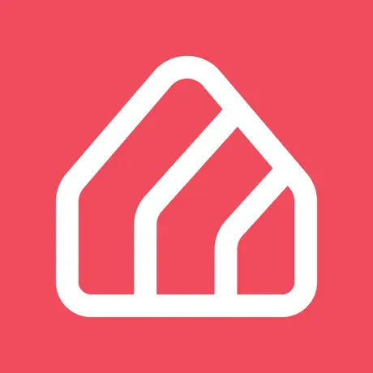

<h1 align="center">Hi, I'm Val 🙋‍♂️ Welcome to my profile!</h1>

 

Experienced React Native Developer with 4.5 years in web and mobile development. Successfully launched projects on app stores. On a recent project, I gained experience building native modules with Swift and Java. Utilizing the Reanimated library and implementing rendering optimization to create smooth UIs. I enjoy working collaboratively and value constructive feedback from teammates to enhance code quality. Ready to bring technical expertise and a results-driven approach to your team.

<h3>Some of my projects</h3>

-  <a href="https://apps.apple.com/ca/app/civex/id1597937318/">Civex</a>: Shareholders votes aggregator

-  <a href="https://apps.apple.com/nz/app/apthub/id6467773304/">AptHub</a>: Discover the future of apartment living with AptHub

-  <a href="https://apps.apple.com/us/app/sober-space/id1541664338?platform=iphone/">Sober Space</a>: Alcogol additction recovery app

<h3 align="left">🌟 Main Skills</h3>

<h4 align="left">Secondary Skills</h4>

<h4 align="left">Familiar with</h4>

--- 

Thanks for stopping by! Feel free to reach out with any questions! 😼 

 
